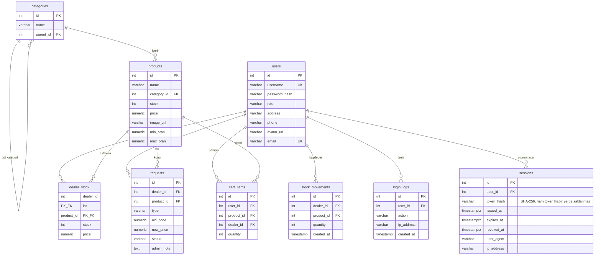

# INTSHOP — Stok ve Sipariş Yönetim Paneli

Çok rollü bir stok yönetim ve mağaza uygulaması. Admin ürün ve kategori kataloğunu
yönetir, bayiler kendi stok ve fiyatlarını belirler, müşteriler mağazadan alışveriş yapar.

> Bu proje bir yaz stajı kapsamında geliştirilmiştir.

<!-- TODO: Ana ekranın görselini buraya koy -->


---

## İçindekiler

- [Özellikler](#özellikler)
- [Teknoloji Yığını](#teknoloji-yığını)
- [Kurulum](#kurulum)
- [Demo Verisi](#demo-verisi)
- [Roller ve Yetkiler](#roller-ve-yetkiler)
- [Ekran Görüntüleri](#ekran-görüntüleri)
- [Veritabanı Şeması](#veritabanı-şeması)
- [API Uçları](#api-uçları)
- [Klasör Yapısı](#klasör-yapısı)
- [Tasarım Kararları](#tasarım-kararları)
- [Gelecek Planları](#gelecek-planları)

---

## Özellikler

**Admin**
- Ürün, kategori ve kullanıcı yönetimi (CRUD)
- Bayilerin fiyat değişiklik taleplerini onaylama / reddetme
- Tüm stok hareketlerini görüntüleme
- Giriş / çıkış logları (filtreleme ve sayfalama ile)

**Bayi**
- Kendi stok ve fiyatlarını yönetme
- Fiyat değişikliği için talep oluşturma
- Taleplerinin durumunu izleme, bekleyen talebi iptal etme
- Stok hareket raporları (Chart.js grafikleri)

**Müşteri**
- Mağazada ürün listeleme (sonsuz kaydırma)
- Kategori ve isim ile filtreleme
- Sepete ekleme, adet değiştirme, sepeti boşaltma
- Aynı ürünü farklı bayilerden ayrı satır olarak sepete ekleyebilme

---

## Teknoloji Yığını

| Katman | Teknoloji |
|---|---|
| Backend | .NET 8 Web API, Dapper |
| Frontend | Svelte 5 (runes), Vite |
| Veritabanı | PostgreSQL 18 |
| Çalışma ortamı | Docker Compose |
| Grafikler | Chart.js |

---

## Kurulum

Tek gereksinim: **Docker Desktop** ve **Git**.

```bash
git clone https://github.com/furkancol10/stok-panel.git
cd stok-panel
docker compose up --build
```

Servisler ayağa kalktıktan sonra:

- Uygulama: http://localhost:5173 (statik build, nginx üzerinden — üretim benzeri)
- API: http://localhost:5081

Veritabanı ilk açılışta `db/init/01-schema.sql` dosyasıyla otomatik olarak kurulur
(sadece şema + kategori/ürün kataloğu — kullanıcı hesabı yok). Demo hesaplarıyla
birlikte örnek verilerle doldurmak istersen, bkz. [Demo Verisi](#demo-verisi).

### Hot-reload ile geliştirme

Varsayılan `docker compose up`, frontend'i statik build + nginx ile servis eder
(değişiklik yapınca yeniden build gerekir). Vite dev sunucusu + hot-reload için:

```bash
docker compose -f docker-compose.yaml -f docker-compose.dev.yaml up --build
```

Bu modda DB portu da (`127.0.0.1:5432`) yerel geliştirme için host'a açılır.

### Ortam değişkenleri

Depoda `.env` dosyası bulunur, varsayılan değerlerle çalışır:

```
POSTGRES_USER=stok
POSTGRES_PASSWORD=1111
POSTGRES_DB=stokdb
API_PORT=5081
```

### Sıfırdan kurulum

Veritabanını tamamen sıfırlamak için:

```bash
docker compose down -v
docker compose up --build
```

`-v` bayrağı veri hacmini (volume) siler; seed dosyası yalnızca boş bir
veritabanında çalışır.

---

## Demo Verisi

Demo hesapları ve onlara bağlı örnek veriler (bayi stoğu, stok hareketleri,
fiyat talepleri) artık otomatik kurulmuyor — `db/init/` altındaki dosyalar
şifreli hiçbir hesap içermiyor. Yerel/geliştirme ortamında istersen elle
uygulayabilirsin:

```bash
docker compose exec -T db psql -U "$POSTGRES_USER" -d "$POSTGRES_DB" < db/seed/dev-seed.sql
```

Bu, `db/seed/dev-seed.sql` içindeki demo hesapları (zayıf, bilinen şifrelerle —
dosyanın kendisinde listeli) ve örnek verileri ekler. **Bu dosyayı asla
internete açık veya prod/staging bir veritabanına uygulama.**

Prod ortamında ilk admin hesabını, kendi belirleyeceğin güçlü bir şifrenin
bcrypt hash'iyle elle oluştur (`INSERT INTO users ...`).

---

## Roller ve Yetkiler

| İşlem | Admin | Bayi | Müşteri |
|---|:---:|:---:|:---:|
| Ürün / kategori yönetimi | ✓ | — | — |
| Kullanıcı yönetimi | ✓ | — | — |
| Talepleri onaylama | ✓ | — | — |
| Giriş loglarını görme | ✓ | — | — |
| Kendi stoğunu yönetme | — | ✓ | — |
| Fiyat talebi oluşturma | — | ✓ | — |
| Mağazadan alışveriş | — | — | ✓ |
| Sepet işlemleri | — | — | ✓ |

Yetki kontrolü **sunucu tarafında** yapılır. İstemci yalnızca niyet bildirir;
kullanıcı kimliği token'dan, fiyat bilgisi veritabanından okunur.

---

## Ekran Görüntüleri

<!-- TODO: docs/img/ klasörüne görselleri koy, aşağıdaki yolları güncelle -->

### Mağaza


### Sepet


### Bayi stok yönetimi


### Admin — talep onayı


### Admin — giriş logları


---

## Veritabanı Şeması



---

## API Uçları

<!-- TODO: Aşağıdaki listeyi controller dosyalarıyla karşılaştırıp doğrula.
     Eksik veya fazla uç varsa düzelt. -->

### Kimlik doğrulama

| Metot | Yol | Rol | Açıklama |
|---|---|---|---|
| POST | `/api/login` | — | Giriş yapar, token döndürür (IP başına dk'da 5 istekle sınırlı) |
| POST | `/api/signup` | — | Müşteri olarak kayıt olur (dk'da 5 istekle sınırlı) |
| POST | `/api/register` | Admin | Admin, Bayi/Kullanıcı/Admin rolünde yeni kullanıcı ekler |
| POST | `/api/logout` | Herkes | Token'ı geçersiz kılar, log kaydı düşer |
| GET | `/api/profile` | Herkes | Oturum sahibinin bilgileri |
| PUT | `/api/profile/password` | Herkes | Şifre değiştirir (mevcut şifreyi doğrular, tüm oturumları iptal eder) |

> Token'lar 12 saat sonra otomatik geçersiz olur. Ham token yalnızca istemciye
> döner — veritabanında `sessions.token_hash` sütununda yalnızca SHA-256 özeti
> tutulur. Yeni bir giriş, aynı kullanıcının önceki aktif oturumlarını iptal eder
> (tek aktif oturum). Çıkış yapmak ilgili oturumu iptal eder (`revoked_at`).

### Katalog

| Metot | Yol | Rol | Açıklama |
|---|---|---|---|
| GET | `/api/products` | Admin | Ürün listesi (kâr marjı sınırları dahil) |
| POST/PUT/DELETE | `/api/products` | Admin | Ürün ekleme / güncelleme / silme |
| GET | `/api/categories` | Herkes (giriş yapmış) | Kategori listesi |
| POST/DELETE | `/api/categories` | Admin | Kategori ekleme / silme |

### Bayi

| Metot | Yol | Rol | Açıklama |
|---|---|---|---|
| GET | `/api/my-stock` | Bayi | Bayinin kendi stok ve fiyatları |
| GET | `/api/requests/mine` | Bayi | Bayinin kendi talepleri |
| PUT | `/api/requests/{id}/cancel` | Bayi | Bekleyen talebi iptal eder |

### Admin

| Metot | Yol | Rol | Açıklama |
|---|---|---|---|
| GET | `/api/requests` | Admin | Tüm talepler |
| PUT | `/api/requests/{id}/approve` | Admin | Talebi onaylar |
| PUT | `/api/requests/{id}/reject` | Admin | Talebi reddeder |
| GET | `/api/users` | Admin | Kullanıcı listesi |
| GET | `/api/movements` | Admin | Stok hareketleri |
| GET | `/api/logs` | Admin | Giriş / çıkış logları (son 100 kayıt) |
| GET | `/api/audit` | Admin | Denetim izi — admin eylemleri (kullanıcı oluşturma, talep onay/red, ürün silme) (son 100 kayıt) |

### Mağaza ve sepet

| Metot | Yol | Rol | Açıklama |
|---|---|---|---|
| GET | `/api/shop` | Müşteri | Mağaza listesi — ürün başına tek satır (en ucuz, eşitlikte en stoklu bayi). Parametreler: `limit`, `offset`, `kategori`, `arama` |
| GET | `/api/shop/{id}` | Müşteri | Ürün detayı — o ürünü satan tüm bayiler, fiyata göre artan sırada |
| GET | `/api/cart` | Müşteri | Sepet içeriği ve toplam tutar |
| POST | `/api/cart` | Müşteri | Sepete ürün ekler (varsa adedi artırır) |
| PUT | `/api/cart/{id}` | Müşteri | Satır adedini günceller |
| DELETE | `/api/cart/{id}` | Müşteri | Satırı siler |
| DELETE | `/api/cart` | Müşteri | Sepeti boşaltır |

---

## Klasör Yapısı

```
stok-panel/
├── backend/                    # .NET 8 Web API
│   ├── Controllers/
│   │   ├── AuthController.cs
│   │   ├── CartController.cs
│   │   ├── LogsControllers.cs
│   │   ├── RequestsController.cs
│   │   ├── ShopController.cs
│   │   └── ...
│   ├── AuthHelper.cs           # Token dogrulama + rol/kullanici cozumleme (12 saat gecerlilik)
│   ├── Program.cs              # CORS + rate limiting (login/signup)
│   └── Dockerfile
├── db/
│   ├── init/
│   │   └── 01-schema.sql       # Şema + kategori/ürün kataloğu (ilk açılışta otomatik çalışır)
│   ├── seed/
│   │   └── dev-seed.sql        # Demo hesapları + örnek veri (elle uygulanır, otomatik değil)
│   └── gercek-sema.sql         # Referans amaçlı guncel şema dökümü
├── frontend/                   # Svelte 5 + Vite (SPA)
│   ├── src/
│   │   ├── lib/
│   │   │   ├── Components/     # Sayfa bileşenleri
│   │   │   ├── Modals/         # Modal pencereler
│   │   │   └── store.svelte.js
│   │   ├── App.svelte
│   │   └── app.css
│   └── Dockerfile
├── docker-compose.yaml
└── .env                        # Git'e dahil değil, .env.example'a bak
```

> **Not:** `sveltekit_gecis` branch'inde frontend, dosya tabanlı routing kullanan
> bir SvelteKit yapısına (`frontend/src/routes/...`) taşınmış durumda — henüz
> deneme aşamasında, `main`'e karışmamış. Detay için o branch'teki PR'a bak.

---

## Tasarım Kararları

**Sepet fiyatı kopyalanmaz.** `cart_items` tablosunda fiyat kolonu yoktur; fiyat
okunurken `dealer_stock` ile birleştirilerek alınır. Böylece bayi fiyatı
değiştirdiğinde iki farklı gerçek oluşmaz.

**Aynı ürün, farklı bayi.** `cart_items` üzerindeki
`UNIQUE (user_id, product_id, dealer_id)` kısıtı sayesinde aynı ürün farklı
bayilerden ayrı satırlar olarak sepete eklenebilir; aynı üçlü tekrar eklendiğinde
ise `ON CONFLICT DO UPDATE` ile adet artar.

**Mağaza filtrelemesi sunucuda.** Mağazada sonsuz kaydırma olduğu için istemci
tarafı filtreleme yalnızca yüklenmiş ürünleri süzerdi. Filtreler SQL'de
`(@param IS NULL OR koşul)` kalıbıyla opsiyonel hale getirilmiştir.

**Bileşen başına veri yükleme.** Her sekme bileşeni kendi verisini `onMount`
içinde çeker. Merkezi bir store yalnızca oturum, ortak durum ve sepet için
kullanılır.

**Mağazada ürün tekilliği.** `/api/shop`, her ürünü tek satırda gösterir;
birden fazla bayi aynı ürünü satıyorsa `DISTINCT ON` ile en ucuz (eşitlikte
en stoklu) teklif seçilir. Diğer bayi tekliflerini görmek ve aralarından
seçim yapmak için ürün detay sayfası (`/api/shop/{id}`) kullanılır — sepete
ekleme yalnızca oradan yapılabilir.

<!-- TODO: Eklemek istediğin başka kararlar varsa buraya yaz -->

---

## Gelecek Planları

- **Sipariş sistemi** — `orders` ve `order_items` tabloları, sepetin siparişe
  dönüşmesi, stok düşürme ve bayi bazlı sipariş bölme
- **JWT tabanlı kimlik doğrulama** — mevcut GUID token artık 12 saat sonra
  otomatik geçersiz oluyor, ama imzalı/self-contained bir token'a (JWT) geçiş
  hâlâ gündemde
- **HTTPS / TLS** — uygulama kodu artık reverse proxy arkasında çalışmaya hazır
  (`UseForwardedHeaders`, `UseHsts`/`UseHttpsRedirection`, config-driven CORS),
  ama TLS'i gerçekten sonlandıracak proxy (Caddy/nginx/harici) henüz compose'a
  eklenmedi — bu, ayrı bir deploy kararı olarak bekliyor
- **SvelteKit'e tam geçiş** — `sveltekit_gecis` branch'inde PoC olarak üç rol
  için de (Kullanıcı/Bayi/Admin) dosya tabanlı routing'e geçildi; `main`'e
  alınıp alınmayacağına henüz karar verilmedi
- **Gerçek sayfalama** — log ve hareket listelerinde istemci tarafı sayfalama
  yerine `LIMIT/OFFSET` ile sunucu tarafı sayfalama
- **Kargo takibi ve bildirimler**
- **Tailwind CSS'e geçiş** — mevcut özel CSS yerine yardımcı sınıf tabanlı sistem
- **Servis katmanı** — controller'lar büyüdükçe iş mantığının `Services/` altına
  taşınması
- **Ürün özellikleri için JSONB** — kategoriye göre değişen özniteliklerin
  esnek şekilde saklanması

---

## Lisans

<!-- TODO: Lisans eklemek istiyor musun? MIT yaygın ve basit bir seçim. -->
