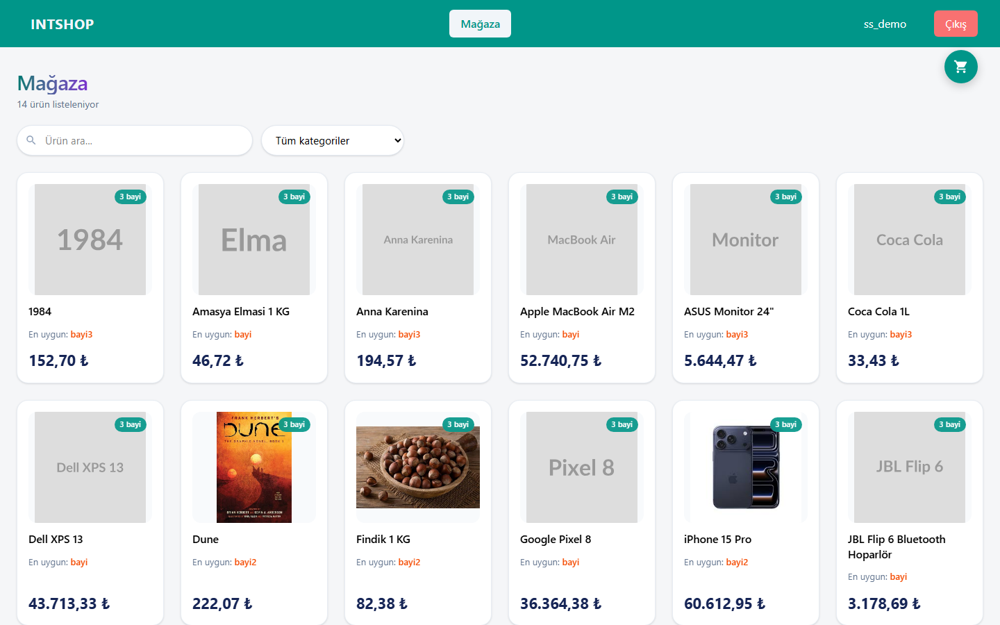
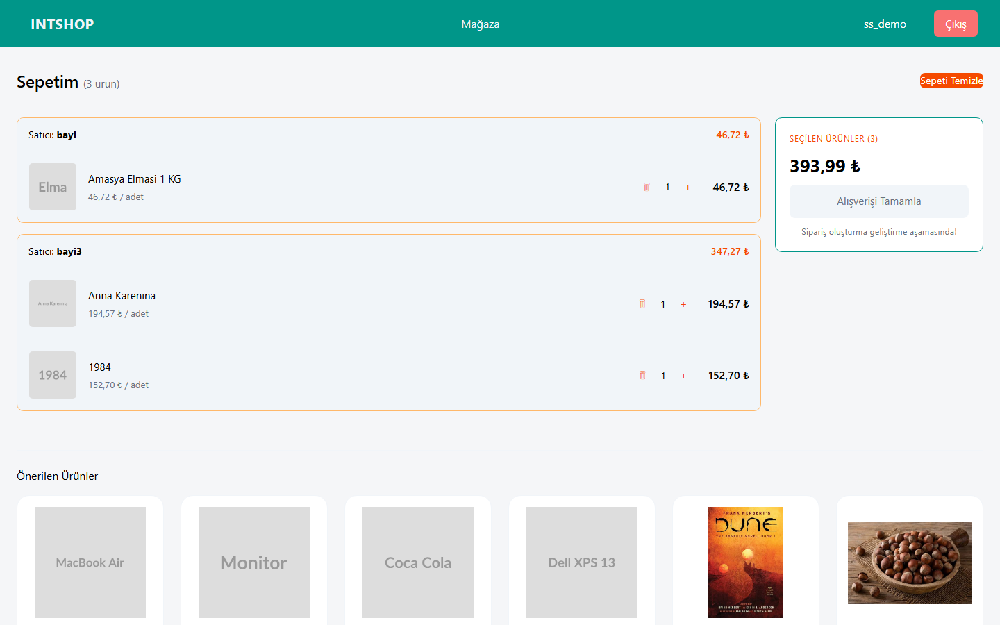
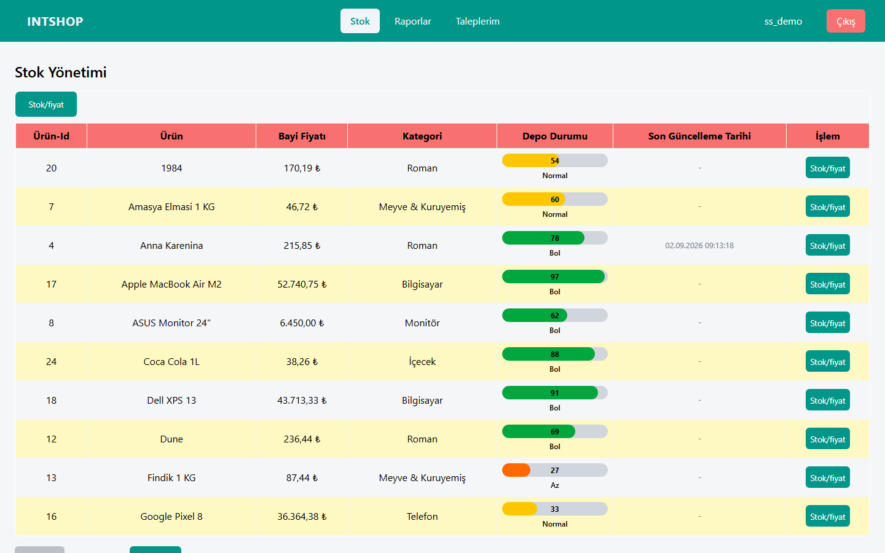
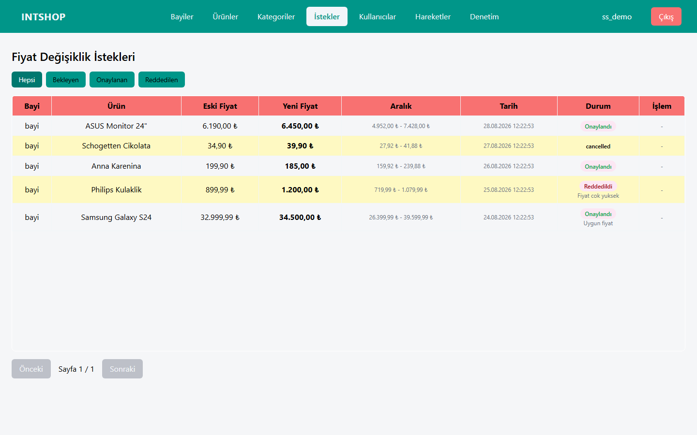
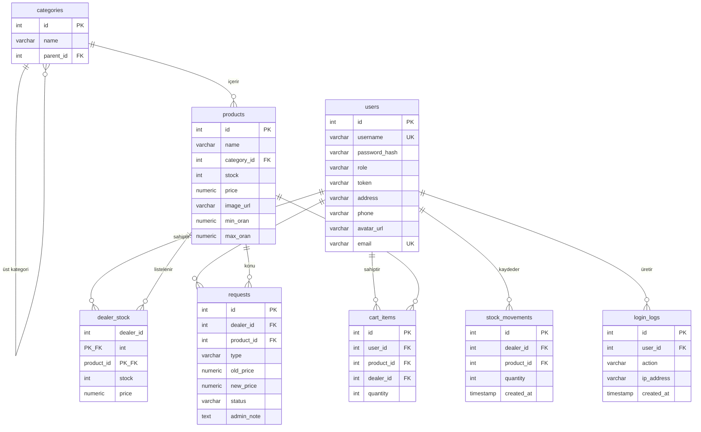

# INTSHOP — Stok ve Sipariş Yönetim Paneli

Çok rollü bir stok yönetim ve mağaza uygulaması. Admin ürün ve kategori kataloğunu
yönetir, bayiler kendi stok ve fiyatlarını belirler, müşteriler mağazadan alışveriş yapar.

> Bu proje bir yaz stajı kapsamında geliştirilmiştir.

<!-- TODO: Ana ekranın görselini buraya koy -->


---

## İçindekiler

- [Özellikler](#özellikler)
- [Teknoloji Yığını](#teknoloji-yığını)
- [Kurulum](#kurulum)
- [Demo Hesapları](#demo-hesapları)
- [Roller ve Yetkiler](#roller-ve-yetkiler)
- [Ekran Görüntüleri](#ekran-görüntüleri)
- [Veritabanı Şeması](#veritabanı-şeması)
- [API Uçları](#api-uçları)
- [Klasör Yapısı](#klasör-yapısı)
- [Tasarım Kararları](#tasarım-kararları)
- [Gelecek Planları](#gelecek-planları)

---

## Özellikler

**Admin**
- Ürün, kategori ve kullanıcı yönetimi (CRUD)
- Bayilerin fiyat değişiklik taleplerini onaylama / reddetme
- Tüm stok hareketlerini görüntüleme
- Giriş / çıkış logları (filtreleme ve sayfalama ile)

**Bayi**
- Kendi stok ve fiyatlarını yönetme
- Fiyat değişikliği için talep oluşturma
- Taleplerinin durumunu izleme, bekleyen talebi iptal etme
- Stok hareket raporları (Chart.js grafikleri)

**Müşteri**
- Mağazada ürün listeleme (sonsuz kaydırma)
- Kategori ve isim ile filtreleme
- Sepete ekleme, adet değiştirme, sepeti boşaltma
- Aynı ürünü farklı bayilerden ayrı satır olarak sepete ekleyebilme

---

## Teknoloji Yığını

| Katman | Teknoloji |
|---|---|
| Backend | .NET 8 Web API, Dapper |
| Frontend | Svelte 5 (runes), Vite |
| Veritabanı | PostgreSQL 18 |
| Çalışma ortamı | Docker Compose |
| Grafikler | Chart.js |

---

## Kurulum

Tek gereksinim: **Docker Desktop** ve **Git**.

```bash
git clone https://github.com/furkancol10/stok-panel.git
cd stok-panel
docker compose up --build
```

Servisler ayağa kalktıktan sonra:

- Uygulama: http://localhost:5173
- API: http://localhost:5081

Veritabanı ilk açılışta `db/init/01-schema.sql` dosyasıyla otomatik olarak kurulur
ve örnek verilerle doldurulur.

### Ortam değişkenleri

Depoda `.env` dosyası bulunur, varsayılan değerlerle çalışır:

```
POSTGRES_USER=stok
POSTGRES_PASSWORD=1111
POSTGRES_DB=stokdb
API_PORT=5081
```

### Sıfırdan kurulum

Veritabanını tamamen sıfırlamak için:

```bash
docker compose down -v
docker compose up --build
```

`-v` bayrağı veri hacmini (volume) siler; seed dosyası yalnızca boş bir
veritabanında çalışır.

---

## Demo Hesapları

| Kullanıcı adı | Şifre | Rol |
|---|---|---|
| `admin` | `admin123` | Admin |
| `bayi` | `bayi123` | Bayi |
| `bayi2` | `bayi123` | Bayi |
| `bayi3` | `bayi123` | Bayi |
| `user1` | `user123` | Müşteri |
| `user2` | `user123` | Müşteri |

---

## Roller ve Yetkiler

| İşlem | Admin | Bayi | Müşteri |
|---|:---:|:---:|:---:|
| Ürün / kategori yönetimi | ✓ | — | — |
| Kullanıcı yönetimi | ✓ | — | — |
| Talepleri onaylama | ✓ | — | — |
| Giriş loglarını görme | ✓ | — | — |
| Kendi stoğunu yönetme | — | ✓ | — |
| Fiyat talebi oluşturma | — | ✓ | — |
| Mağazadan alışveriş | — | — | ✓ |
| Sepet işlemleri | — | — | ✓ |

Yetki kontrolü **sunucu tarafında** yapılır. İstemci yalnızca niyet bildirir;
kullanıcı kimliği token'dan, fiyat bilgisi veritabanından okunur.

---

## Ekran Görüntüleri

<!-- TODO: docs/img/ klasörüne görselleri koy, aşağıdaki yolları güncelle -->

### Mağaza


### Sepet


### Bayi stok yönetimi


### Admin — talep onayı


### Admin — giriş logları


---

## Veritabanı Şeması



---

## API Uçları

<!-- TODO: Aşağıdaki listeyi controller dosyalarıyla karşılaştırıp doğrula.
     Eksik veya fazla uç varsa düzelt. -->

### Kimlik doğrulama

| Metot | Yol | Rol | Açıklama |
|---|---|---|---|
| POST | `/api/login` | — | Giriş yapar, token döndürür |
| POST | `/api/logout` | Herkes | Token'ı geçersiz kılar, log kaydı düşer |
| GET | `/api/profile` | Herkes | Oturum sahibinin bilgileri |

### Katalog

| Metot | Yol | Rol | Açıklama |
|---|---|---|---|
| GET | `/api/products` | — | Ürün listesi |
| GET | `/api/categories` | — | Kategori listesi |

### Bayi

| Metot | Yol | Rol | Açıklama |
|---|---|---|---|
| GET | `/api/my-stock` | Bayi | Bayinin kendi stok ve fiyatları |
| GET | `/api/requests/mine` | Bayi | Bayinin kendi talepleri |
| PUT | `/api/requests/{id}/cancel` | Bayi | Bekleyen talebi iptal eder |

### Admin

| Metot | Yol | Rol | Açıklama |
|---|---|---|---|
| GET | `/api/requests` | Admin | Tüm talepler |
| PUT | `/api/requests/{id}/approve` | Admin | Talebi onaylar |
| PUT | `/api/requests/{id}/reject` | Admin | Talebi reddeder |
| GET | `/api/users` | Admin | Kullanıcı listesi |
| GET | `/api/movements` | Admin | Stok hareketleri |
| GET | `/api/logs` | Admin | Giriş / çıkış logları (son 100 kayıt) |

### Mağaza ve sepet

| Metot | Yol | Rol | Açıklama |
|---|---|---|---|
| GET | `/api/shop` | Müşteri | Mağaza listesi. Parametreler: `limit`, `offset`, `kategori`, `arama` |
| GET | `/api/cart` | Müşteri | Sepet içeriği ve toplam tutar |
| POST | `/api/cart` | Müşteri | Sepete ürün ekler (varsa adedi artırır) |
| PUT | `/api/cart/{id}` | Müşteri | Satır adedini günceller |
| DELETE | `/api/cart/{id}` | Müşteri | Satırı siler |
| DELETE | `/api/cart` | Müşteri | Sepeti boşaltır |

---

## Klasör Yapısı

```
stok-panel/
├── api/                       # .NET 8 Web API
│   ├── Controllers/
│   │   ├── AuthController.cs
│   │   ├── CartController.cs
│   │   ├── LogsController.cs
│   │   ├── RequestsController.cs
│   │   ├── ShopController.cs
│   │   └── ...
│   ├── Program.cs
│   └── Dockerfile
├── db/
│   └── init/
│       └── 01-schema.sql      # Şema + örnek veri (ilk açılışta çalışır)
├── frontend/                  # Svelte 5 + Vite
│   ├── src/
│   │   ├── lib/
│   │   │   ├── Components/    # Sayfa bileşenleri
│   │   │   ├── Modals/        # Modal pencereler
│   │   │   └── store.svelte.js
│   │   ├── App.svelte
│   │   └── app.css
│   └── Dockerfile
├── docker-compose.yaml
└── .env
```

---

## Tasarım Kararları

**Sepet fiyatı kopyalanmaz.** `cart_items` tablosunda fiyat kolonu yoktur; fiyat
okunurken `dealer_stock` ile birleştirilerek alınır. Böylece bayi fiyatı
değiştirdiğinde iki farklı gerçek oluşmaz.

**Aynı ürün, farklı bayi.** `cart_items` üzerindeki
`UNIQUE (user_id, product_id, dealer_id)` kısıtı sayesinde aynı ürün farklı
bayilerden ayrı satırlar olarak sepete eklenebilir; aynı üçlü tekrar eklendiğinde
ise `ON CONFLICT DO UPDATE` ile adet artar.

**Mağaza filtrelemesi sunucuda.** Mağazada sonsuz kaydırma olduğu için istemci
tarafı filtreleme yalnızca yüklenmiş ürünleri süzerdi. Filtreler SQL'de
`(@param IS NULL OR koşul)` kalıbıyla opsiyonel hale getirilmiştir.

**Bileşen başına veri yükleme.** Her sekme bileşeni kendi verisini `onMount`
içinde çeker. Merkezi bir store yalnızca oturum, ortak durum ve sepet için
kullanılır.

<!-- TODO: Eklemek istediğin başka kararlar varsa buraya yaz -->

---

## Gelecek Planları

- **Sipariş sistemi** — `orders` ve `order_items` tabloları, sepetin siparişe
  dönüşmesi, stok düşürme ve bayi bazlı sipariş bölme
- **JWT tabanlı kimlik doğrulama** — mevcut GUID token yerine süreli, imzalı token
- **Gerçek sayfalama** — log ve hareket listelerinde istemci tarafı sayfalama
  yerine `LIMIT/OFFSET` ile sunucu tarafı sayfalama
- **Kargo takibi ve bildirimler**
- **Tailwind CSS'e geçiş** — mevcut özel CSS yerine yardımcı sınıf tabanlı sistem
- **Servis katmanı** — controller'lar büyüdükçe iş mantığının `Services/` altına
  taşınması
- **Ürün özellikleri için JSONB** — kategoriye göre değişen özniteliklerin
  esnek şekilde saklanması

---

## Lisans

<!-- TODO: Lisans eklemek istiyor musun? MIT yaygın ve basit bir seçim. -->
